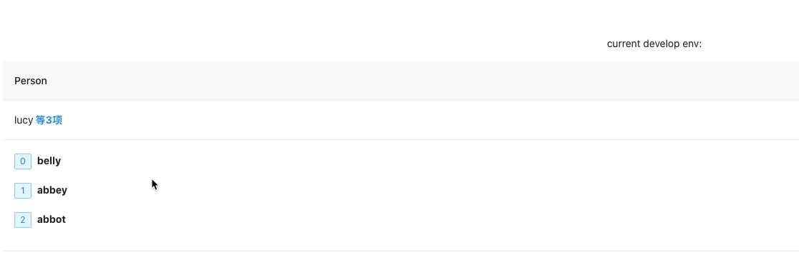
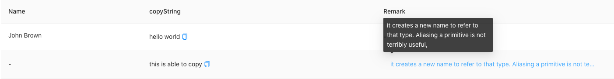
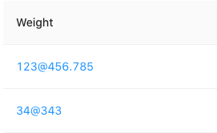
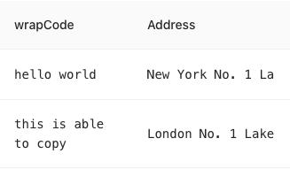
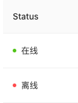
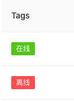
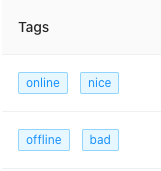
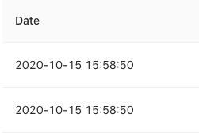

## Quick Start

Here's a quick demostration:

```tsx
import renderCell from 'cell-render'

function App() {
  const columns = [
    {
      title: 'Name',
      dataIndex: 'name',
      key: 'name',
      width: 120,
      render: (value: any) => {
        return renderCell('string', value)
      },
    },
    ...
  ]
  return (
    <div className="App" style={{ padding: '50px' }}>
      <Table scroll={{ x: 1500}} columns={columns} dataSource={data} />
    </div>
  )
}

export default App
```

Theoretically, you can use this pacakge whrenver you want to render literal content!


## API

Here, here✨

Cell-Render can greatly easy to render table cell(emmm, mostly used in the scene), but you can also use it to render something else.

We can easily use it like this:

```js
const tpl = renderCell("string", value, {width: '20px'}, { callback: () => { console.log("hello") }})
```

`renderCell` can accept four params:

- `type`: define which template to return
- `value`: target content to be rendered
- `style`: define the element inner style
- `config`: addon config to control the rendered template


### list

Look at this below:



We design some config items to control the cell display

```typescript
render: (value: any) => {
  return renderCell('list', value, undefined, {
    // the maxium to display in cell
    max: 3,
    callback: () => {
      message.success(value.join("~"))
    },
    // render each item
    itemRender: (item: string, index: number) => {
      return (
        <>
        {renderCell('tags', index)}
          <b>{item}</b>
        </>
      )
    },
  })
},
```


- `Config.max: number` used to define when to join the list
  - `list.length > max`: aggrefate the list
  - `list.length <= max`: display the list normally
  - `max: -1`: display all list

- `Config.key` can render the target value with `item[key]` rather then `item`, it's useful when you pass the `{key: string, value: string}[]`

- `itemRender(value: any, index: number )` is designed to render the each item

- `callback(value: any)` used to catch the [join list length] click event

- `style: {[index: string]: any}` used to change the render style as we mentioned


### string

Look at this below:



1. `renderCell('string', value) ` normal render

2. `renderCell('string', value, {}, { copyable: boolean | { text: string, tooltips: boolean} })` to make the value copyable

3. `renderCell('string', value, {}, { callback: () => {}})` to make the content has a callback event

String is **auto support ellipsis**, and it's controled by `copyable` and `callback`

**`copyable` has higher priority than `callback`**


### number

Look at this below:



Here is a quick demonstration:

```tsx
{
  title: 'Weight',
  dataIndex: 'weight',
  key: 'weight',
  width: 120,
  render: (value: any) => {
    return renderCell(
      'number',
      value,
      { color: '#1890ff' },
      { splitLabel: '@' }
    )
  },
}
```


- `Config:{ splitLabel: string }` means to replace the splite separator, default is `,`
- And no worry about decimal, I have handle it correctly, see [thsplite](https://y-lonely.github.io/ele-utility/) from more information!


### code

Look at this below:



1. `renderCell('code', value)` return normal render content in single line(without wrapped)

2. `renderCell('code', value, {}, { wrap: 'wrap' })` render the code in multi-lines


### status

Look at this below:



You can easily use like this: `renderCell('status', value, {}, { color: '#ef613e' })`

or you can transfer a status list like this:

```typescript
export const status = [
  {
    value: 'online',
    color: '#52c41a',
    label: '在线'
  },
  {
    value: 'offline',
    color: '#ff4d4f',
    label: '离线'
  },
]

render: (value: any) => {
  return renderCell('status', value, undefined, {
    color: status
  })
}
```

About color, you can see [ant-badge](https://ant.design/components/badge-cn/) for some inspirations!


### tags

Look at this below:



In fact, `tags` is roughly the same with `status`, the main difference is the `color`, tags support status directions, like 'success', 'error' etc.



Tags support the typeof data is **Array**, you can just do  `renderCell('tag', ['hello', 'world'], {}, { color: 'blue'})`


### date

Look at this below:



We use [dayJS](https://dayjs.gitee.io/) to parse the date(some reason for ending with the moment, sadly)，so you can do like this `renderCell('date', value, {}, { format: 'YYYY-MM-DD HH:mm:ss'})`

And if the date is invalid, it will console the error and return '-'


**Solo with code✨**